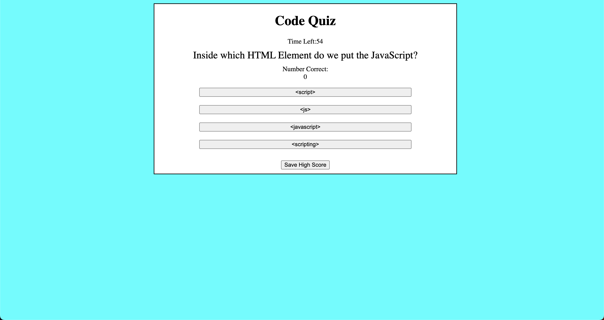

# Code Quiz

## Description

This is a quiz meant to test the users knowledge of Javascript. 
https://tommy-henderson.github.io/code-quiz/

## Installation

N/A

## Usage

User can select start quiz to begin taking the quiz. There are 7 questions, and a timer for 60 seconds. Each time the user selects a correct answer, the score will increase by 1. Any time the user selects an incorrect answer, the timer subtracts 10 seconds. The quiz ends when the user runs out of questions or the timer expires. 
The user can also click the "save high score" button where they will be prompted to type in their name to save their high score to local storage. This button also displays the current high score holder on the page. 

## Credits

Referred to this repo to help with timer: 
https://github.com/CailinBellWold/Code-Quiz/tree/main

Referred to this video to help understand event listeners: 
https://www.youtube.com/watch?v=XF1_MlZ5l6M&t=928s&ab_channel=WebDevSimplified

## License

Please refer to license in repo. 